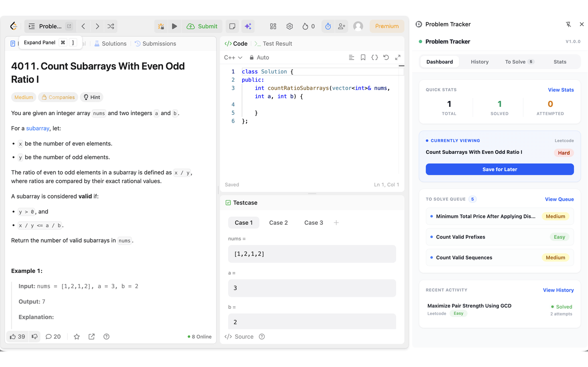

# 🧩 Problem Tracker

[](manifest.ts)
[](https://react.dev/)
[](https://www.typescriptlang.org/)
[](manifest.ts)

A lightweight, high-performance Google Chrome extension (Manifest V3) built with React 19 and TypeScript that automatically tracks your LeetCode problem-solving progress, manages a personal "To Solve" queue, and visualizes DSA statistics natively inside Chrome's SidePanel drawer.

---

## 📸 Demo

<p align="center">
  
</p>

---

## ✨ Features

- **⚡ Instant Auto Detection**: Automatically parses LeetCode problem pages (title, difficulty, topic tags) and logs submission verdicts (*Accepted* / *Attempted*) in real time.
- **📌 Chrome SidePanel Drawer**: Keeps your Dashboard, Queue, Stats, and History open alongside the coding environment—no context switching or tab switching required.
- **🕒 Problem History Tracker**: Automatically records every problem attempt, tracking attempt counts, first-seen timestamps, and last-opened dates.
- **🔖 "To Solve" Bookmark Queue**: Save challenging problems with a single click and launch them directly from your side panel whenever you are ready to practice. Items are automatically removed from the queue once solved.
- **📊 Real-Time DSA Analytics**: Displays total solved count, total attempts, and difficulty distribution progress bars (*Easy* - Green, *Medium* - Amber, *Hard* - Red).
- **🔒 100% Privacy & Local Storage**: All data is stored locally via `chrome.storage.local`. Zero external tracking, zero analytics servers, zero remote accounts.

---

## 🌐 Compatibility

| Browser | Minimum Version | Status |
| :--- | :--- | :--- |
| **Google Chrome** | Chrome 114+ | Full Support (Manifest V3 SidePanel) |
| **Brave Browser** | Chromium 114+ | Full Support |
| **Microsoft Edge** | Edge 114+ | Full Support |
| **Opera / Arc / Vivaldi** | Chromium 114+ | Full Support |

---

## 🚀 Installation

### Option 1: Chrome Web Store (Recommended)

👉 [**Install from Chrome Web Store**](#) *(Coming soon)*

---

### Option 2: Load Unpacked (Manual / Developer Mode)

1. **Clone or Download** this repository:
   ```bash
   git clone https://github.com/kprakash18/DSA-tacker.git
   cd "DSA tracker"
   ```

2. **Install dependencies and build the project:**
   ```bash
   npm install
   npm run build
   ```

3. Open Google Chrome and navigate to:
   ```text
   chrome://extensions/
   ```

4. Enable **Developer mode** via the toggle switch in the top-right corner.

5. Click **Load unpacked** in the top-left corner.

6. Select the `dist` folder generated by the build inside this project directory.

7. Pin **Problem Tracker** to your extensions toolbar for quick access.

---

## 🛠️ How to Use

### 1. Automatic Problem Detection
- Click the **Problem Tracker** extension icon in your toolbar to open Chrome's native SidePanel.
- Navigate to any problem on [LeetCode](https://leetcode.com/problems/two-sum/).
- The extension automatically parses the problem title, difficulty level, and topic tags.

### 2. Submitting Solutions
- Submit your code as you normally would on LeetCode.
- Problem Tracker automatically captures the submission verdict (*Accepted* or *Attempted*) and updates your statistics in real time.

### 3. Managing "To Solve" Queue
- Click **Save to Solve Later** on the active problem card to bookmark questions.
- View and launch bookmarked problems directly from the **To Solve** tab.
- When you solve a bookmarked problem, it is automatically cleared from your queue.

### 4. Viewing Analytics & History
- Click the **Stats** tab for a detailed breakdown of your solved count by difficulty (*Easy*, *Medium*, *Hard*).
- Click the **History** tab to inspect a timeline of your recent attempts.

---

## 🔒 Permissions & Privacy

Privacy is a core design principle of Problem Tracker. **No user data ever leaves your browser.**

| Permission | Justification & Scope |
| :--- | :--- |
| **`storage`** | Saves your problem history, attempt counts, bookmarks, and DSA stats locally in `chrome.storage.local`. |
| **`sidePanel`** | Renders the extension dashboard, queue, statistics, and history inside Chrome's native SidePanel drawer. |
| **`host_permissions` (`https://leetcode.com/*`)** | Allows the content script to run on LeetCode problem pages to parse metadata and detect submission verdicts. |

---

## 📂 Project Structure

```text
DSA tracker/
├── manifest.ts             # Manifest V3 extension configuration (via @crxjs/vite-plugin)
├── vite.config.ts          # Vite build & plugin configuration
├── package.json            # Project dependencies & scripts
├── public/                 # Extension toolbar & store icons
│   └── icons/
│       ├── store_icon_128x128.png
│       ├── active/
│       └── inactive/
├── src/
│   ├── background/         # Service worker runtime message handlers & icon managers
│   │   ├── service-worker.ts
│   │   └── iconManager.ts
│   ├── platforms/          # Platform DOM observers & verdict detectors
│   │   └── leetcode/
│   │       ├── index.ts
│   │       ├── dom.ts
│   │       └── network.ts
│   ├── shared/             # Shared TypeScript types, message constants & logger
│   │   ├── types.ts
│   │   ├── messages.ts
│   │   └── utils/
│   ├── sidepanel/          # React 19 SidePanel UI
│   │   ├── App.tsx
│   │   ├── components/     # Dashboard, Stats, History, & Navigation views
│   │   ├── hooks/          # Chrome storage sync hooks
│   │   └── services/       # Sidebar runtime message API
│   ├── storage/            # Repository pattern over chrome.storage.local
│   │   ├── ProblemRepository.ts
│   │   └── ToSolveRepository.ts
│   └── styles/             # Tailwind CSS v4 styles
├── dsatracker.gif          # Extension demo animation
├── PRIVACY_POLICY.md       # Privacy policy documentation
└── README.md               # Project documentation
```

---

## 📄 License & Privacy

Problem Tracker is open-source software. All user data remains 100% local on your device. Read the full [Privacy Policy](PRIVACY_POLICY.md).
